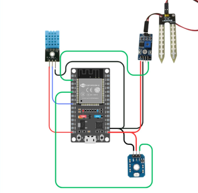

# Soil Moisture Alert 🌱
A simple IoT-based soil moisture monitoring system designed to assist in smart irrigation and environmental monitoring.

## 🚀 Project Overview
**Soil Moisture Alert** uses an ESP32 microcontroller combined with soil moisture sensors and environmental sensors (DHT11, UV sensor) to track soil and weather conditions. The system generates conditional alerts to help optimize irrigation based on real-time data and environmental factors.

## ⚙️ Features
- Real-time soil moisture monitoring
- Temperature and humidity sensing using DHT11
- UV intensity measurement for sunlight detection
- Conditional alert generation for irrigation recommendations
- Designed for scalability and integration with mobile notifications or APIs

## 🛠️ Tech Stack
- **ESP32** (Microcontroller)
- **Arduino IDE** (Firmware Development)
- **DHT11 Sensor** (Temperature & Humidity)
- **Soil Moisture Sensor**
- **UV Sensor** (UV Status)
- **Serial Monitor / Mobile Alert** (Output System)

## 📊 Future Improvements
- Integration with weather APIs for predictive irrigation recommendations
- Mobile app or dashboard for remote monitoring
- Battery-powered deployment for field use
- Data logging and trend visualization

## 🔧 Setup Instructions
1. Connect sensors to the ESP32 board as per the wiring diagram.
2. Load the Arduino code from this repository onto your ESP32 using Arduino IDE.
3. Monitor soil moisture and environmental data via Serial Monitor or extend for mobile notifications.
4. Modify alert thresholds in the code to suit your soil conditions.

## 📷 System Overview

## 📄 License
This project is open-source and available under the MIT License.
